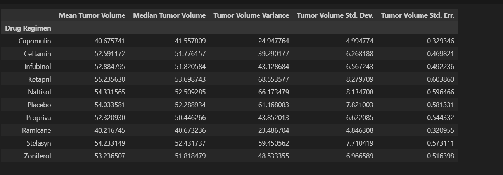
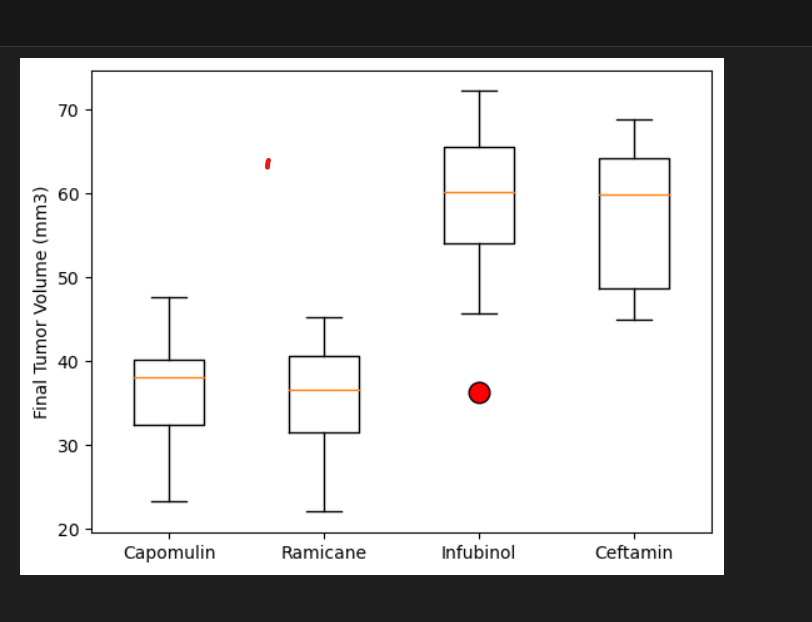
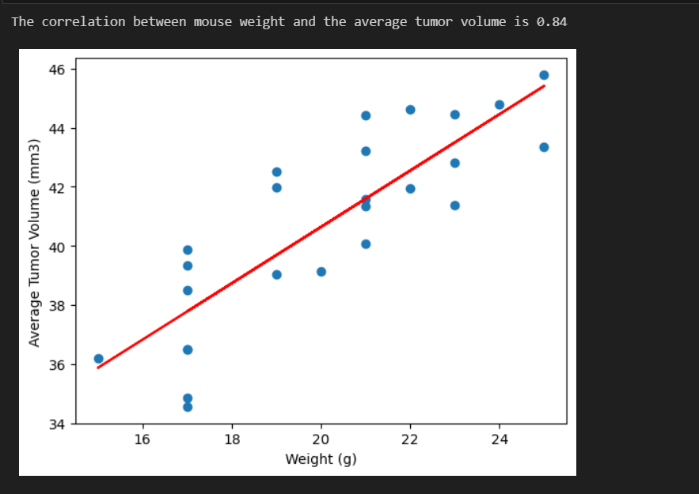

# Pymaceuticals-pymaceuticals_starter.ipynb

## Background

What good is data without a good plot to tell the story?

So, let's take what you've learned about Python Matplotlib and apply it to a real-world situation and dataset:

While your data companions rushed off to jobs in finance and government, you remained adamant that science was the way for you. Staying true to your mission, you've joined Pymaceuticals Inc., a burgeoning pharmaceutical company based out of San Diego. Pymaceuticals specializes in anti-cancer pharmaceuticals. In its most recent efforts, it began screening for potential treatments for squamous cell carcinoma (SCC), a commonly occurring form of skin cancer.

As a senior data analyst at the company, you've been given access to the complete data from their most recent animal study. In this study, 249 mice identified with SCC tumor growth were treated through a variety of drug regimens. Over the course of 45 days, tumor development was observed and measured. The purpose of this study was to compare the performance of Pymaceuticals' drug of interest, Capomulin, versus the other treatment regimens. You have been tasked by the executive team to generate all of the tables and figures needed for the technical report of the study. The executive team also has asked for a top-level summary of the study results.

## Instructions

  This assignment is broken down into the following tasks:

  * Prepare the data.

  * Generate summary statistics.

  

  * Create bar charts and pie charts.

  * Calculate quartiles, find outliers, and create a box plot.

  * Create a line plot and a scatter plot.

  * Calculate correlation and regression.

  * Submit your final analysis.

## Prepare the Data

  * Run the provided package dependency and data imports, and then merge the mouse_metadata and study_results DataFrames into a single DataFrame.

  * Before beginning the analysis, check the data for any mouse ID with duplicate time points and remove any data associated with that mouse ID.

  * Use the cleaned data for the remaining steps.

  * Display the updated number of unique mice IDs.

  * Generate a summary statistics table consisting of the mean, median, variance, standard deviation, and SEM of the tumor volume for each drug 
    regimen.

## Generate Summary Statistics

   Create a DataFrame of summary statistics. Remember, there is more than one method to produce the results you're after, so the method you use  
   is less important than the result.

   Your summary statistics should include:

  * A row for each drug regimen. These regimen names should be contained in the index column.

  * A column for each of the following statistics: mean, median, variance, standard deviation, and SEM of the tumor volume.

## Create Bar Charts and Pie Charts

  * Generate a bar plot using both Pandas's `DataFrame.plot()` and Matplotlib's `pyplot` that shows  the number of total mice/timepoints for   
    each treatment regimen throughout the course of the study.

  * **NOTE:** These plots should look identical.

 ## Calculate Quartiles, Find Outliers, and Create a Box Plot 

  * A DatFrame that has the last timepoint for each mouse ID is created using groupby.

  * The index of the DataFrame is reset. 
  
  * Retrieve the maximum timepoint for each mouse. 

  * The four treatment groups, Capomulin, Ramicane, Infubinol, and Ceftamin, are put in a list. 

  * An empty list is created to fill with tumor volume data. 

  * A for loop is used to display the interquartile range (IQR) and the outliers for each treatment group 

  * A box plot is generated that shows the distribution of the final tumor volume for all the mice in each treatment group.

  ## Create a Line Plot and a Scatter Plot
  * A line plot is generated that shows the tumor volume vs. time point for one mouse treated with Capomulin. 

  * A scatter plot is generated that shows average tumor volume vs. mouse weight for the Capomulin regimen. 

    

## Calculate Correlation and Regression

  * The correlation coefficient and linear regression model are calculated for mouse weight and average tumor volume for the Capomulin regimen. 

    